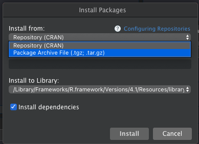
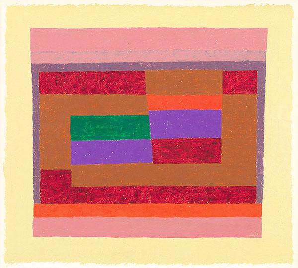

# MedBrewer

Provides a series of art-based colorful palettes.

Version 1.0.1 (1/25/2022)

## Install Package
MedBrewer is now able to be downloaded through the GitLab [here](https://gitlab.com/bioinformatics-inem/r-custom-packages/MedBrewer).

1. Locate and download the file `MedBrewer_1.0.1.tar.gz` (the numbers indicate the version of the package).

2. In R Studio, choose `Packages>Install>Install from: Package Archive File (.tgz; .tar.gz)` 



And navigate to the downloaded archive.

## Usage

The function `med.brewer` calls the palette. You can specify the number of colors to use (and interpolate colors), or choose between discrete or continuous palettes as exemplified below.

It can be directly called in `ggplot2`. 

```{r}
library(MedBrewer)
med.brewer("MED")
```


```{r}
library(ggplot2)
ggplot(data=iris, aes(x=Species, y=Petal.Length, fill=Species)) +
geom_violin() +
scale_fill_manual(values=med.brewer("Corot", 3))
```


```{r}
ggplot(data=iris, aes(x=Sepal.Length, y=Sepal.Width, color=Species)) +
geom_point(size=2) +
scale_color_manual(values=med.brewer("Merz", 3))
```


```{r}
ggplot(data=iris, aes(x=Species, y=Sepal.Width, color=Sepal.Width)) +
geom_point(size=3) +
scale_color_gradientn(colors=med.brewer("Albers1"))
```


## Palettes

### Albers1




### Albers2


### Balanced


### Corot


### MED


### Merz


### Vallotton


### Wellspring


